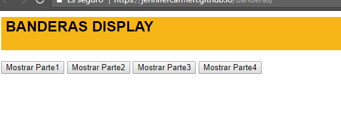
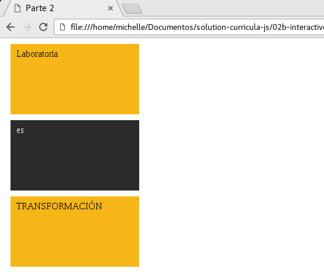
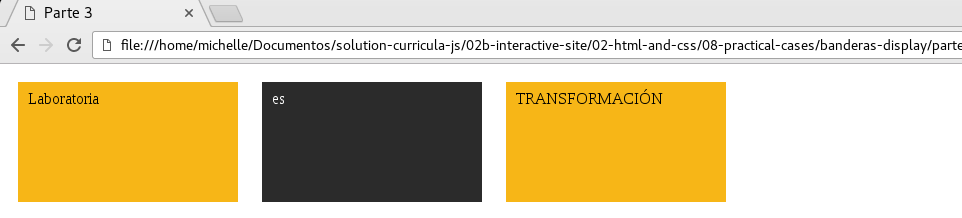
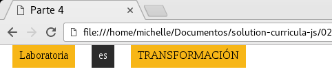

# Banderas Display
* En este ejercicio ponemos  en práctica nuestros conocimientos de display
* Para ello como pagina principal mostramos un menu en los que el usuario podra seleccionar cual de las 4 opciones desea ver
* Se muestran 4 botones que al darle clic se ejecuta una función dependiendo de la función de cada uno

* En la opción uno se oculta el menu y se muestra la parte 1
* Cuando el usuario ingresa debajo de la parte 1 se muestra la opción 1 que le permite al usuario volver al menu principal de igual forma para las demás opciones se  muestra cada parte que corresponde a la opción para que esto pase hice uso de onclick en cada boton que lo que hace es que cuando reciba un evento clic se ejecute una función.

* Esta función esta contenida en la carpeta js archivo app.,js en el que en cada función obtiene el id del div y aplicamos la propiedad display según sea el caso para ocultar y mostrar un div.
* Al mostrarse cada parte(div) este busca su clase en la hoja de estilos y muestra el diseño según su clase

